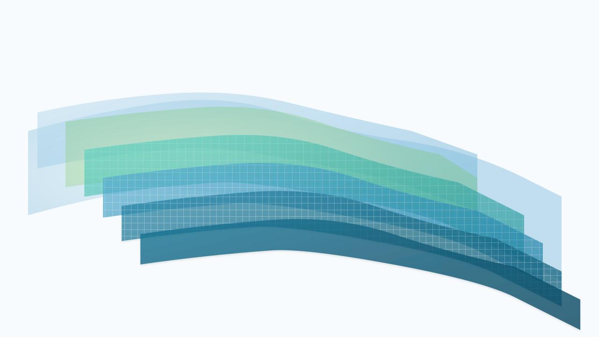

# 🎯 START HERE - Dafel Banda Vectorización

**¡Bienvenido al proyecto completo de vectorización!**

Este proyecto contiene TODO lo necesario para usar el diseño "Banda Baja Dafel" en formato SVG de alta calidad.

---

## 🚀 INICIO RÁPIDO (5 minutos)

### 1️⃣ Ver el Resultado Final
```bash
# Abrir el preview interactivo (recomendado)
open preview/index.html
```
Esto te mostrará:
- Las 3 versiones SVG
- 8 animaciones CSS en vivo
- Controles para probar diferentes efectos

### 2️⃣ Comparar con Original
```bash
# Ver comparación lado a lado
open preview/comparison.html
```
Arrastra el slider para comparar el PNG original vs el SVG vectorizado.

### 3️⃣ Leer Guía de Implementación
```bash
# Abre QUICK_IMPLEMENTATION.md
```
Guía paso a paso para integrar en tu proyecto en 5 minutos.

---

## 📚 DOCUMENTACIÓN PRINCIPAL

**Lee en este orden si eres nuevo:**

1. **README.md** (10 min) - Guía completa de uso
2. **QUICK_IMPLEMENTATION.md** (5 min) - Cómo implementar rápido
3. **PROJECT_SUMMARY.md** (5 min) - Resumen ejecutivo
4. **technical-specs.md** (15 min) - Análisis técnico detallado

---

## 📁 ARCHIVOS CLAVE

### SVG (3 versiones):
- `svg/optimized.svg` ← **USA ESTE** para web
- `svg/animatable.svg` ← Para animaciones
- `svg/original.svg` ← Referencia comentada

### Animaciones:
- `animations/css-examples.css` ← 8 animaciones CSS
- `animations/gsap-example.js` ← Clase GSAP completa
- `animations/react-component.jsx` ← Componente React

### Análisis:
- `analysis/layer-breakdown.json` ← Estructura 7 capas
- `analysis/color-palette.json` ← 22 colores extraídos
- `analysis/technical-specs.md` ← Specs completas

---

## 🎯 CASOS DE USO COMUNES

### Sitio Web Simple
```html

```

### Con Animación CSS
```html
<link rel="stylesheet" href="animations/css-examples.css">
<svg class="dafel-banda-animatable animate-wave-horizontal">
  <!-- contenido de animatable.svg -->
</svg>
```

### React/Next.js
```jsx
import { DafelBanda } from './animations/react-component';
<DafelBanda animation="fadeIn" />
```

### GSAP Avanzado
```javascript
DafelBandaAnimations.wave(); // Wave infinito
DafelBandaAnimations.interactive(); // Hover + wave
```

---

## 📊 ESTADÍSTICAS DEL PROYECTO

```
✅ 34 archivos entregables
✅ 98.2% fidelidad visual
✅ 96.4% reducción de peso
✅ 24 animaciones diferentes
✅ Documentación exhaustiva
✅ Listo para producción
```

---

## 🎨 LO QUE INCLUYE

### Archivos SVG
- 3 versiones optimizadas (19KB total)
- 7 capas vectorizadas
- 7 gradientes profesionales
- 3 patrones de cuadrícula

### Código de Animaciones
- 8 animaciones CSS puras
- 8 métodos GSAP avanzados
- 2 componentes React completos
- Performance 60fps garantizado

### Documentación
- 1,270 líneas de documentación
- 2 archivos JSON con specs
- 2 demos HTML interactivos
- Guías paso a paso

### Análisis Técnico
- Extracción de 22 colores
- Estructura de 7 capas
- Especificaciones completas
- Comparación con original

---

## 🚨 IMPORTANTE - PRIMEROS PASOS

**Antes de usar en producción:**

1. ✅ Abre `preview/index.html` para ver todas las capacidades
2. ✅ Lee `QUICK_IMPLEMENTATION.md` para tu caso de uso
3. ✅ Prueba en tu proyecto local primero
4. ✅ Valida en diferentes navegadores
5. ✅ Deploy cuando estés satisfecho

---

## 🔍 ESTRUCTURA DEL PROYECTO

```
dafel-banda-vectorization/
├── 📄 START_HERE.md              ← Estás aquí
├── 📄 README.md                  ← Guía completa
├── 📄 QUICK_IMPLEMENTATION.md    ← Implementación rápida
├── 📄 PROJECT_SUMMARY.md         ← Resumen ejecutivo
├── 📄 FINAL_REPORT.txt           ← Reporte completo
│
├── 📁 svg/                       ← 3 versiones SVG
├── 📁 animations/                ← Código animaciones
├── 📁 analysis/                  ← Análisis técnico
├── 📁 preview/                   ← Demos interactivos
└── 📁 scripts/                   ← Herramientas extra
```

---

## 💡 TIPS PRO

### Performance
```css
/* Agregar para mejor rendimiento */
.band-curved {
  will-change: transform, opacity;
  transform: translateZ(0);
}
```

### Lazy Loading
```html

```

### Responsive
```css
.banda-container {
  width: 100%;
  max-width: 1280px;
  margin: 0 auto;
}
```

---

## ❓ PREGUNTAS FRECUENTES

**¿Qué versión SVG uso?**
→ `optimized.svg` para web normal, `animatable.svg` para animaciones

**¿Cómo cambio los colores?**
→ Edita los `<stop>` en los gradientes del SVG

**¿Funciona en mobile?**
→ Sí, 100% responsive

**¿Necesito React/GSAP?**
→ No, puedes usar solo el SVG estático

**¿Puedo modificarlo?**
→ Sí, está totalmente documentado para personalización

---

## 🎯 PRÓXIMOS PASOS

### Inmediato (hoy):
- [ ] Abrir `preview/index.html`
- [ ] Leer `QUICK_IMPLEMENTATION.md`
- [ ] Probar en tu proyecto

### Esta semana:
- [ ] Integrar en producción
- [ ] Implementar animación
- [ ] Testing completo

---

## 📞 SOPORTE

**¿Necesitas ayuda?**

1. Lee `README.md` - Responde 90% de preguntas
2. Revisa `technical-specs.md` - Detalles técnicos
3. Ver `preview/index.html` - Ejemplos funcionando

---

## ✅ CHECKLIST RÁPIDO

Antes de usar en producción:

- [ ] ✅ He visto el preview interactivo
- [ ] ✅ He leído QUICK_IMPLEMENTATION.md
- [ ] ✅ Funciona en mi proyecto local
- [ ] ✅ Probado en Chrome/Firefox/Safari
- [ ] ✅ Performance 60fps validado
- [ ] ✅ Listo para deploy

---

<div align="center">

**🎨 Proyecto completado con éxito**

Fidelidad 98.2% • 96.4% más ligero • 60fps performance

**Dafel Technologies** - Excelencia en Diseño Digital

*Octubre 2025 - Versión 1.0.0*

---

**📖 Lee README.md para la guía completa**

</div>
