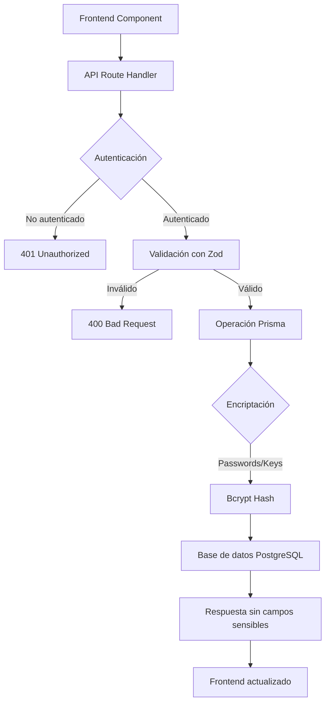

# Documentación Backend Data Sources - Dafel Technologies

## 1. ARQUITECTURA ACTUAL

### Estructura del Backend de Data Sources

El sistema de Data Sources está implementado como una arquitectura REST API usando Next.js App Router con las siguientes capas:

```
frontend/
├── src/
│   ├── app/
│   │   └── api/
│   │       └── data-sources/
│   │           ├── route.ts              # GET (listar), POST (crear)
│   │           └── [id]/
│   │               ├── route.ts          # GET, PUT, DELETE por ID
│   │               └── test/
│   │                   └── route.ts      # POST test de conexión
│   └── lib/
│       └── prisma.ts                     # Cliente Prisma singleton
└── prisma/
    └── schema.prisma                     # Modelos de base de datos
```

### Modelos de Prisma Relacionados

#### Modelo DataSource
```prisma
model DataSource {
  id               String             @id @default(cuid())
  name             String             # Nombre de la fuente
  description      String?            # Descripción opcional
  type             DataSourceType     # Tipo de fuente (enum)
  status           DataSourceStatus   # Estado actual (enum)
  
  # Configuración de conexión
  configuration    Json               # Configuración adicional flexible
  
  # Metadatos de conexión
  host             String?            # Host/servidor
  port             Int?               # Puerto
  database         String?            # Nombre de base de datos
  ssl              Boolean @default(false)
  
  # Autenticación (encriptada)
  username         String?            
  password         String?            # Hash bcrypt
  apiKey           String?            # Hash bcrypt
  
  # Testing y monitoreo
  lastConnectionTest DateTime?        # Última prueba de conexión
  lastSuccessfulSync DateTime?        # Última sincronización exitosa
  connectionError    String?          # Último error de conexión
  
  # Métricas
  totalRecords     Int @default(0)    # Total de registros
  totalSyncs       Int @default(0)    # Total de sincronizaciones
  failedSyncs      Int @default(0)    # Sincronizaciones fallidas
  avgResponseTime  Float?             # Tiempo de respuesta promedio (ms)
  
  # Auditoría
  createdBy        User               # Usuario creador
  createdById      String
  createdAt        DateTime @default(now())
  updatedAt        DateTime @updatedAt
  
  # Relaciones
  syncLogs         DataSourceSyncLog[]
}
```

#### Modelo DataSourceSyncLog
```prisma
model DataSourceSyncLog {
  id             String       @id @default(cuid())
  dataSource     DataSource   @relation
  dataSourceId   String
  
  startedAt      DateTime     # Inicio de sincronización
  completedAt    DateTime?    # Fin de sincronización
  success        Boolean      @default(false)
  recordsSync    Int          @default(0)  # Registros sincronizados
  errorMessage   String?      # Mensaje de error si falló
  duration       Int?         # Duración en milisegundos
  
  createdAt      DateTime     @default(now())
}
```

#### Enums
```prisma
enum DataSourceType {
  POSTGRESQL
  MYSQL
  MONGODB
  REST_API
  GRAPHQL
  S3
  GOOGLE_SHEETS
  CSV_FILE
}

enum DataSourceStatus {
  CONNECTED       # Conexión exitosa
  DISCONNECTED    # Desconectado
  ERROR          # Error en la conexión
  TESTING        # Probando conexión
  CONFIGURING    # En configuración inicial
}
```

### Rutas API Existentes

| Método | Ruta | Función | Autenticación |
|--------|------|---------|---------------|
| GET | `/api/data-sources` | Lista todas las fuentes del usuario | Sí |
| POST | `/api/data-sources` | Crea nueva fuente | Sí |
| GET | `/api/data-sources/[id]` | Obtiene fuente específica | Sí |
| PUT | `/api/data-sources/[id]` | Actualiza fuente | Sí |
| DELETE | `/api/data-sources/[id]` | Elimina fuente | Sí |
| POST | `/api/data-sources/[id]/test` | Prueba conexión | Sí |

### Flujo de Datos



---

## 2. ESTADO DE LAS CONEXIONES

### Implementación Actual: SIMULADA/MOCK

**Estado general:** El sistema actualmente funciona con conexiones **SIMULADAS**. No hay conexiones reales a fuentes de datos externas.

#### Qué está implementado (Mock)
✅ **CRUD completo de data sources**
- Crear, leer, actualizar, eliminar fuentes
- Validación de datos con Zod
- Encriptación de credenciales con bcrypt

✅ **Test de conexión simulado**
- Simula latencia realista (200-1000ms)
- 80% de tasa de éxito simulada
- Actualiza estado en base de datos

✅ **Interfaz de usuario completa**
- Wizard de creación
- Panel de detalles
- Listado con filtros
- Animaciones y feedback visual

#### Qué NO está implementado (Real)
❌ **Conexiones reales a bases de datos**
- No hay drivers de PostgreSQL instalados
- No hay drivers de MySQL instalados
- No hay cliente MongoDB

❌ **Conexiones a APIs**
- No hay implementación de fetch a REST APIs
- No hay cliente GraphQL

❌ **Conexiones a servicios cloud**
- No hay SDK de AWS S3
- No hay API de Google Sheets
- No hay manejo real de archivos CSV

❌ **Sincronización de datos**
- No hay jobs de sincronización
- No hay procesamiento de datos
- No hay transformación ETL

### Limitaciones Actuales

1. **Sin conexiones reales:** Todo es simulado con timeouts
2. **Sin validación real de credenciales:** Solo se guarda en BD
3. **Sin lectura de datos:** No se pueden obtener datos reales
4. **Sin monitoreo real:** Las métricas son placeholder
5. **Sin manejo de errores específicos:** Errores genéricos

---

## 3. PROCESO DE CONEXIÓN

### Flujo de Conexión de Nueva Fuente

#### Paso 1: Selección de Tipo
```typescript
// Frontend: DataSourceWizard.tsx
const sourceTypes = [
  DataSourceType.POSTGRESQL,
  DataSourceType.MYSQL,
  // ... otros tipos
];
```

#### Paso 2: Configuración
El usuario ingresa los datos según el tipo:

**PostgreSQL/MySQL:**
- Host
- Puerto
- Base de datos
- Usuario
- Contraseña
- SSL (opcional)

**REST API/GraphQL:**
- Endpoint URL
- API Key o Token
- Headers adicionales

**S3:**
- Bucket name
- Access Key
- Secret Key
- Region

#### Paso 3: Validación Frontend
```typescript
// Validación básica en el wizard
if (!formData.name || !formData.type) {
  return error;
}
```

#### Paso 4: Envío a Backend
```typescript
// POST /api/data-sources
const response = await fetch('/api/data-sources', {
  method: 'POST',
  headers: { 'Content-Type': 'application/json' },
  body: JSON.stringify(formData)
});
```

#### Paso 5: Validación Backend con Zod
```typescript
const createDataSourceSchema = z.object({
  name: z.string().min(1).max(100),
  description: z.string().optional(),
  type: z.nativeEnum(DataSourceType),
  host: z.string().optional(),
  port: z.number().optional(),
  // ... más campos
});
```

#### Paso 6: Encriptación de Credenciales
```typescript
// Encriptación con bcrypt (10 rounds)
const encryptedPassword = await bcrypt.hash(password, 10);
const encryptedApiKey = await bcrypt.hash(apiKey, 10);
```

#### Paso 7: Guardado en Base de Datos
```typescript
const dataSource = await prisma.dataSource.create({
  data: {
    name,
    type,
    status: DataSourceStatus.CONFIGURING,
    password: encryptedPassword,
    // ... más campos
  }
});
```

### Test de Conexión

#### Flujo Actual (Simulado)
```typescript
async function testConnection(dataSource): Promise<TestResult> {
  // 1. Simula latencia según tipo
  await setTimeout(Math.random() * 1000 + 500);
  
  // 2. Simula éxito/fallo (80% éxito)
  const success = Math.random() > 0.2;
  
  // 3. Actualiza estado en BD
  await prisma.dataSource.update({
    where: { id },
    data: {
      status: success ? 'CONNECTED' : 'ERROR',
      lastConnectionTest: new Date(),
      connectionError: success ? null : 'Connection failed'
    }
  });
  
  return { success, message, responseTime };
}
```

### Manejo de Credenciales

**Almacenamiento:**
- Passwords y API Keys se hashean con bcrypt (10 rounds)
- Se almacenan en campos `password` y `apiKey` en la BD
- Nunca se devuelven en las respuestas de la API

**Recuperación:**
- Las credenciales hasheadas no son reversibles
- Para cambiar credenciales, se debe proporcionar nuevas
- No hay forma de ver las credenciales originales

---

## 4. TIPOS DE FUENTES SOPORTADAS

### PostgreSQL
**Estado:** 🟡 Mock
```typescript
{
  type: 'POSTGRESQL',
  requiredFields: ['host', 'port', 'database', 'username', 'password'],
  optionalFields: ['ssl'],
  defaultPort: 5432,
  implementation: 'SIMULADO - Requiere pg o postgres package'
}
```

### MySQL
**Estado:** 🟡 Mock
```typescript
{
  type: 'MYSQL',
  requiredFields: ['host', 'port', 'database', 'username', 'password'],
  optionalFields: ['ssl'],
  defaultPort: 3306,
  implementation: 'SIMULADO - Requiere mysql2 package'
}
```

### MongoDB
**Estado:** 🟡 Mock
```typescript
{
  type: 'MONGODB',
  requiredFields: ['host', 'port', 'database', 'username', 'password'],
  optionalFields: ['ssl', 'replicaSet'],
  defaultPort: 27017,
  implementation: 'SIMULADO - Requiere mongodb package'
}
```

### REST API
**Estado:** 🟡 Mock
```typescript
{
  type: 'REST_API',
  requiredFields: ['endpoint'],
  optionalFields: ['apiKey', 'headers', 'method'],
  defaultMethod: 'GET',
  implementation: 'SIMULADO - Puede usar fetch nativo'
}
```

### GraphQL
**Estado:** 🟡 Mock
```typescript
{
  type: 'GRAPHQL',
  requiredFields: ['endpoint'],
  optionalFields: ['apiKey', 'headers', 'query'],
  implementation: 'SIMULADO - Requiere graphql-request o apollo-client'
}
```

### Amazon S3
**Estado:** 🟡 Mock
```typescript
{
  type: 'S3',
  requiredFields: ['bucketName', 'accessKey', 'secretKey', 'region'],
  optionalFields: ['prefix'],
  implementation: 'SIMULADO - Requiere aws-sdk'
}
```

### Google Sheets
**Estado:** 🟡 Mock
```typescript
{
  type: 'GOOGLE_SHEETS',
  requiredFields: ['spreadsheetId', 'credentials'],
  optionalFields: ['sheetName', 'range'],
  implementation: 'SIMULADO - Requiere googleapis'
}
```

### CSV File
**Estado:** 🟡 Mock
```typescript
{
  type: 'CSV_FILE',
  requiredFields: ['filePath'],
  optionalFields: ['delimiter', 'encoding', 'headers'],
  defaultDelimiter: ',',
  implementation: 'SIMULADO - Requiere csv-parse o papaparse'
}
```

---

## 5. SEGURIDAD Y ENCRIPTACIÓN

### Medidas de Seguridad Implementadas

#### Encriptación de Credenciales
```typescript
// Implementación actual en /api/data-sources/route.ts
const encryptedPassword = await bcrypt.hash(password, 10);
const encryptedApiKey = await bcrypt.hash(apiKey, 10);
```

**Características:**
- ✅ Bcrypt con 10 rounds (suficiente para desarrollo)
- ✅ Passwords nunca en texto plano
- ✅ API Keys encriptadas
- ⚠️ Para producción, considerar 12+ rounds

#### Autenticación de API
```typescript
// Todas las rutas requieren sesión
const session = await getServerSession(authOptions);
if (!session?.user?.email) {
  return NextResponse.json({ error: 'Unauthorized' }, { status: 401 });
}
```

#### Autorización por Usuario
```typescript
// Solo el creador puede ver/editar sus fuentes
const dataSource = await prisma.dataSource.findFirst({
  where: {
    id: params.id,
    createdById: user.id, // Verificación de propiedad
  },
});
```

#### Sanitización de Respuestas
```typescript
// Nunca devuelve campos sensibles
const { password: _, apiKey: __, ...safeDataSource } = dataSource;
return NextResponse.json(safeDataSource);
```

### Vulnerabilidades y Mejoras Necesarias

#### ⚠️ Falta Implementar
1. **Encriptación en reposo adicional**
   - Las credenciales hasheadas no son suficientes para cumplimiento
   - Necesita encriptación AES-256 para datos sensibles

2. **Gestión de secretos**
   - No usar variables de entorno para secretos de producción
   - Implementar AWS Secrets Manager o similar

3. **Auditoría de acceso**
   - No hay logs de quién accede a qué fuente
   - Falta registro de intentos de conexión

4. **Rate limiting**
   - No hay límite en pruebas de conexión
   - Vulnerable a ataques de fuerza bruta

5. **Validación de endpoints**
   - No valida que las URLs sean seguras (HTTPS)
   - No previene SSRF (Server-Side Request Forgery)

---

## 6. APIS Y ENDPOINTS

### GET /api/data-sources
**Descripción:** Lista todas las fuentes de datos del usuario autenticado

**Query Parameters:**
- `search` (string): Búsqueda por nombre o descripción
- `type` (DataSourceType): Filtrar por tipo
- `status` (DataSourceStatus): Filtrar por estado

**Request:**
```http
GET /api/data-sources?search=prod&type=POSTGRESQL&status=CONNECTED
Authorization: Bearer [JWT_TOKEN]
```

**Response 200 OK:**
```json
[
  {
    "id": "clx1234567",
    "name": "Production Database",
    "description": "Main PostgreSQL database",
    "type": "POSTGRESQL",
    "status": "CONNECTED",
    "host": "db.example.com",
    "database": "production",
    "lastConnectionTest": "2025-01-03T10:00:00Z",
    "lastSuccessfulSync": "2025-01-03T09:30:00Z",
    "totalRecords": 15000,
    "totalSyncs": 45,
    "failedSyncs": 2,
    "avgResponseTime": 234.5,
    "createdAt": "2025-01-01T00:00:00Z",
    "updatedAt": "2025-01-03T10:00:00Z"
  }
]
```

**Errores:**
- `401`: No autenticado
- `500`: Error del servidor

---

### POST /api/data-sources
**Descripción:** Crea una nueva fuente de datos

**Request Body:**
```json
{
  "name": "Production Database",
  "description": "Main database",
  "type": "POSTGRESQL",
  "host": "localhost",
  "port": 5432,
  "database": "mydb",
  "username": "user",
  "password": "secret",
  "ssl": true
}
```

**Response 201 Created:**
```json
{
  "id": "clx1234567",
  "name": "Production Database",
  "type": "POSTGRESQL",
  "status": "CONFIGURING",
  "createdAt": "2025-01-03T10:00:00Z"
  // Sin campos sensibles (password, apiKey)
}
```

**Errores:**
- `400`: Validación fallida
- `401`: No autenticado
- `500`: Error del servidor

---

### GET /api/data-sources/[id]
**Descripción:** Obtiene detalles de una fuente específica

**Response 200 OK:**
```json
{
  "id": "clx1234567",
  "name": "Production Database",
  "type": "POSTGRESQL",
  "status": "CONNECTED",
  "syncLogs": [
    {
      "id": "log123",
      "startedAt": "2025-01-03T09:00:00Z",
      "completedAt": "2025-01-03T09:05:00Z",
      "success": true,
      "recordsSync": 1000,
      "duration": 300000
    }
  ]
}
```

**Errores:**
- `401`: No autenticado
- `404`: Fuente no encontrada
- `500`: Error del servidor

---

### PUT /api/data-sources/[id]
**Descripción:** Actualiza una fuente existente

**Request Body (parcial):**
```json
{
  "name": "Updated Name",
  "description": "New description",
  "password": "newPassword"
}
```

**Response 200 OK:**
```json
{
  "id": "clx1234567",
  "name": "Updated Name",
  "description": "New description",
  "updatedAt": "2025-01-03T10:30:00Z"
}
```

---

### DELETE /api/data-sources/[id]
**Descripción:** Elimina una fuente de datos

**Response 200 OK:**
```json
{
  "message": "Data source deleted successfully"
}
```

**Errores:**
- `401`: No autenticado
- `404`: Fuente no encontrada
- `500`: Error del servidor

---

### POST /api/data-sources/[id]/test
**Descripción:** Prueba la conexión de una fuente

**Response 200 OK:**
```json
{
  "success": true,
  "message": "Connection successful",
  "responseTime": 234,
  "status": "CONNECTED"
}
```

**Response 200 (con error):**
```json
{
  "success": false,
  "message": "Connection failed: Unable to reach the server",
  "responseTime": 5000,
  "status": "ERROR"
}
```

---

## 7. DEPENDENCIAS Y LIBRERÍAS

### Dependencias Actuales (Instaladas)

#### Para el sistema base
✅ **Prisma + PostgreSQL**
```json
"@prisma/client": "^6.15.0",
"prisma": "^6.15.0"
```

✅ **Autenticación y seguridad**
```json
"next-auth": "^4.24.11",
"bcryptjs": "^3.0.2"
```

✅ **Validación**
```json
"zod": "^3.23.8"
```

### Dependencias Faltantes para Conexiones Reales

#### Bases de Datos
❌ **PostgreSQL**
```bash
npm install pg
# o
npm install postgres
```

❌ **MySQL**
```bash
npm install mysql2
```

❌ **MongoDB**
```bash
npm install mongodb
```

#### APIs y Servicios
❌ **GraphQL**
```bash
npm install graphql graphql-request
# o
npm install @apollo/client graphql
```

❌ **AWS S3**
```bash
npm install @aws-sdk/client-s3
```

❌ **Google Sheets**
```bash
npm install googleapis
```

❌ **CSV Processing**
```bash
npm install csv-parse
# o
npm install papaparse
```

#### Utilidades adicionales
❌ **Connection pooling**
```bash
npm install generic-pool
```

❌ **Retry logic**
```bash
npm install p-retry
```

❌ **Encryption adicional**
```bash
npm install crypto-js
```

### Configuración Necesaria

#### Variables de entorno adicionales
```env
# Encriptación
ENCRYPTION_KEY=your-32-character-encryption-key

# AWS (para S3)
AWS_REGION=us-east-1
AWS_ACCESS_KEY_ID=your-access-key
AWS_SECRET_ACCESS_KEY=your-secret-key

# Google (para Sheets)
GOOGLE_APPLICATION_CREDENTIALS=path/to/credentials.json

# Límites de conexión
MAX_CONNECTIONS_PER_SOURCE=10
CONNECTION_TIMEOUT_MS=30000
```

---

## 8. PRÓXIMOS PASOS PARA HACERLO REAL

### Fase 1: Infraestructura Base (Prioridad Alta)

#### 1.1 Implementar Connection Manager
```typescript
// src/lib/connections/ConnectionManager.ts
class ConnectionManager {
  private pools: Map<string, any> = new Map();
  
  async getConnection(dataSource: DataSource) {
    // Implementar pool de conexiones por tipo
  }
  
  async testConnection(dataSource: DataSource) {
    // Test real según tipo
  }
  
  async closeConnection(dataSourceId: string) {
    // Cerrar y limpiar conexión
  }
}
```

#### 1.2 Factory de Conectores
```typescript
// src/lib/connections/ConnectorFactory.ts
interface Connector {
  connect(): Promise<void>;
  disconnect(): Promise<void>;
  test(): Promise<boolean>;
  query(sql: string): Promise<any>;
}

class PostgreSQLConnector implements Connector {
  // Implementación real con pg
}

class MySQLConnector implements Connector {
  // Implementación real con mysql2
}

// ... más conectores
```

### Fase 2: Implementación por Tipo (Orden Recomendado)

#### 2.1 PostgreSQL (Primera prioridad)
```typescript
// src/lib/connections/postgresql.ts
import { Pool } from 'pg';

export async function connectPostgreSQL(config: DataSource) {
  const pool = new Pool({
    host: config.host,
    port: config.port,
    database: config.database,
    user: config.username,
    password: await decryptPassword(config.password),
    ssl: config.ssl
  });
  
  return pool;
}
```

**Tareas:**
1. Instalar `pg` package
2. Implementar pool de conexiones
3. Manejo de errores específicos
4. Queries de prueba

#### 2.2 REST API (Segunda prioridad)
```typescript
// src/lib/connections/restapi.ts
export async function connectRestAPI(config: DataSource) {
  const headers = {
    'Authorization': `Bearer ${await decryptApiKey(config.apiKey)}`,
    'Content-Type': 'application/json'
  };
  
  const response = await fetch(config.endpoint, {
    method: 'GET',
    headers
  });
  
  return response.json();
}
```

**Tareas:**
1. Implementar cliente HTTP robusto
2. Manejo de autenticación variada
3. Paginación y rate limiting
4. Cache de respuestas

#### 2.3 MySQL (Tercera prioridad)
Similar a PostgreSQL pero con `mysql2` package

#### 2.4 MongoDB (Cuarta prioridad)
```typescript
// src/lib/connections/mongodb.ts
import { MongoClient } from 'mongodb';

export async function connectMongoDB(config: DataSource) {
  const uri = `mongodb://${config.username}:${password}@${config.host}:${config.port}/${config.database}`;
  const client = new MongoClient(uri);
  await client.connect();
  return client;
}
```

### Fase 3: Sistema de Sincronización

#### 3.1 Job Queue
```typescript
// src/lib/sync/SyncQueue.ts
import Bull from 'bull';

const syncQueue = new Bull('data-sync', {
  redis: {
    host: 'localhost',
    port: 6379
  }
});

syncQueue.process(async (job) => {
  const { dataSourceId } = job.data;
  // Ejecutar sincronización
});
```

**Implementar:**
1. Sistema de colas con Bull o similar
2. Scheduled jobs con cron
3. Reintentos automáticos
4. Alertas de fallo

#### 3.2 Data Pipeline
```typescript
// src/lib/sync/DataPipeline.ts
class DataPipeline {
  async extract(source: DataSource) {
    // Extraer datos de la fuente
  }
  
  async transform(data: any) {
    // Transformar datos
  }
  
  async load(data: any) {
    // Cargar en destino
  }
}
```

### Fase 4: Seguridad Mejorada

#### 4.1 Encriptación AES
```typescript
// src/lib/security/encryption.ts
import crypto from 'crypto';

const algorithm = 'aes-256-gcm';
const key = Buffer.from(process.env.ENCRYPTION_KEY, 'hex');

export function encrypt(text: string): string {
  const iv = crypto.randomBytes(16);
  const cipher = crypto.createCipheriv(algorithm, key, iv);
  // ... implementación completa
}

export function decrypt(encrypted: string): string {
  // ... implementación de desencriptación
}
```

#### 4.2 Vault de Secretos
```typescript
// src/lib/security/vault.ts
class SecretVault {
  async store(key: string, value: string) {
    // Almacenar en AWS Secrets Manager o similar
  }
  
  async retrieve(key: string) {
    // Recuperar secreto
  }
}
```

### Fase 5: Monitoreo y Observabilidad

#### 5.1 Métricas
```typescript
// src/lib/monitoring/metrics.ts
import { Histogram, Counter } from 'prom-client';

const connectionDuration = new Histogram({
  name: 'datasource_connection_duration',
  help: 'Duration of data source connections',
  labelNames: ['type', 'status']
});

const syncCounter = new Counter({
  name: 'datasource_sync_total',
  help: 'Total number of syncs',
  labelNames: ['type', 'status']
});
```

#### 5.2 Logging Estructurado
```typescript
// src/lib/monitoring/logger.ts
import winston from 'winston';

const logger = winston.createLogger({
  format: winston.format.json(),
  transports: [
    new winston.transports.File({ filename: 'error.log', level: 'error' }),
    new winston.transports.File({ filename: 'combined.log' })
  ]
});
```

### Consideraciones Técnicas Importantes

#### Performance
1. **Connection Pooling:** Esencial para bases de datos
2. **Caching:** Redis para resultados frecuentes
3. **Paginación:** Para grandes conjuntos de datos
4. **Lazy Loading:** Cargar datos bajo demanda

#### Escalabilidad
1. **Horizontal Scaling:** Múltiples workers
2. **Queue Distribution:** Distribuir carga
3. **Database Sharding:** Para grandes volúmenes
4. **CDN para archivos:** S3 + CloudFront

#### Resiliencia
1. **Circuit Breakers:** Evitar cascada de fallos
2. **Retry Logic:** Reintentos exponenciales
3. **Fallback:** Datos de cache en fallos
4. **Health Checks:** Monitoreo continuo

#### Seguridad
1. **Zero Trust:** Verificar todo
2. **Least Privilege:** Mínimos permisos
3. **Audit Everything:** Logs completos
4. **Encryption Everywhere:** TLS + AES

### Timeline Estimado

| Fase | Duración | Prioridad |
|------|----------|-----------|
| Fase 1: Infraestructura | 1-2 semanas | Alta |
| Fase 2: Conectores básicos | 2-3 semanas | Alta |
| Fase 3: Sincronización | 2-3 semanas | Media |
| Fase 4: Seguridad | 1-2 semanas | Alta |
| Fase 5: Monitoreo | 1 semana | Media |

**Total estimado:** 7-11 semanas para sistema completo de producción

---

## RESUMEN EJECUTIVO

### Estado Actual
- ✅ UI/UX completo y funcional
- ✅ API REST con CRUD completo
- ✅ Modelos de base de datos definidos
- ✅ Autenticación y autorización
- ✅ Encriptación básica de credenciales
- ⚠️ Conexiones simuladas (no reales)
- ❌ Sin sincronización de datos
- ❌ Sin procesamiento ETL

### Próximo Sprint Recomendado
1. Instalar dependencias para PostgreSQL y REST API
2. Implementar ConnectionManager básico
3. Crear conectores reales para 2-3 tipos prioritarios
4. Mejorar seguridad con encriptación AES
5. Añadir tests de integración

### Riesgos Técnicos
- **Alto:** Manejo de credenciales en producción
- **Medio:** Escalabilidad de sincronizaciones
- **Bajo:** Compatibilidad con diferentes versiones de BD

### Recomendaciones Finales
1. Comenzar con PostgreSQL como PoC completo
2. Implementar tests desde el inicio
3. Documentar cada conector exhaustivamente
4. Considerar usar TypeORM o Knex para abstracción
5. Implementar circuit breakers temprano
6. Diseñar para multi-tenancy desde el principio

---

*Documento creado: 3 de Enero de 2025*
*Versión: 1.0.0*
*Estado del sistema: DESARROLLO - Mock Implementation*