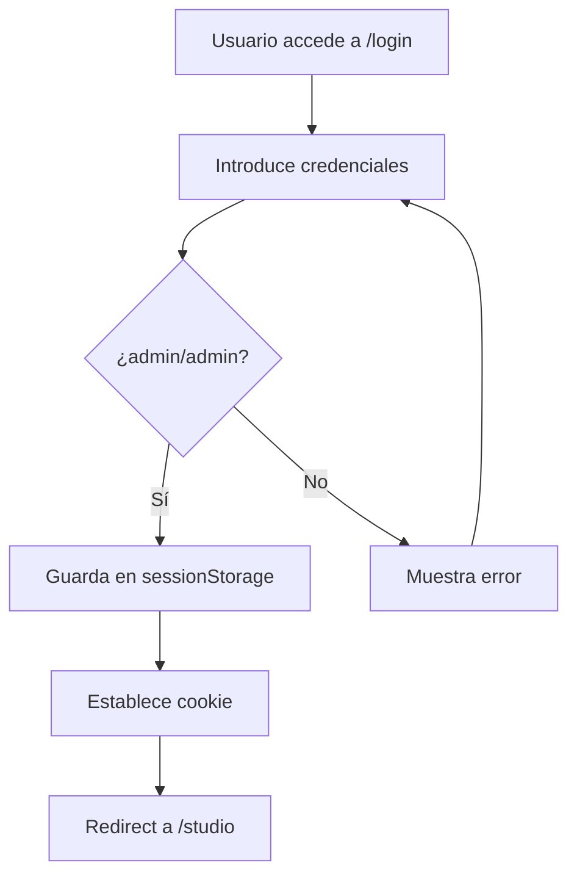
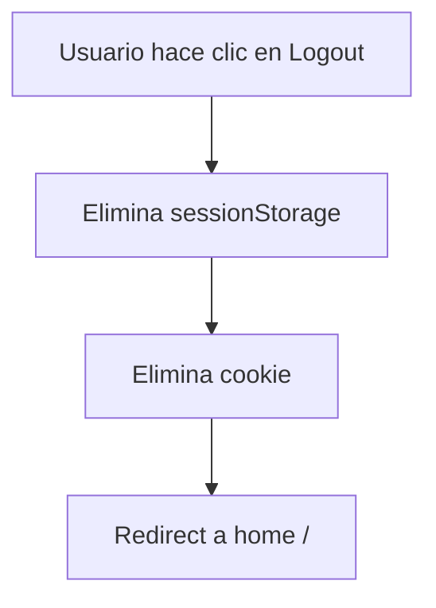

# Dafel Technologies - Documentación del Sistema de Autenticación

## 1. ESTADO ACTUAL DE LA AUTENTICACIÓN

### Tipo de autenticación implementada
- **Tipo:** Autenticación básica con credenciales hardcodeadas
- **Fase:** Desarrollo/Prototipo (NO apto para producción)
- **Método:** Comparación directa de strings en el cliente

### Nivel de seguridad actual
- **Nivel:** MUY BAJO - Solo para desarrollo
- **Riesgos:** Credenciales visibles en código fuente, sin encriptación, sin backend
- **Estado:** Sistema temporal para proteger el acceso al Studio durante desarrollo

### Archivos involucrados
| Archivo | Ubicación | Función |
|---------|-----------|---------|
| login/page.tsx | `/frontend/src/app/login/page.tsx` | Página de login con formulario |
| studio/page.tsx | `/frontend/src/app/studio/page.tsx` | Maneja logout y limpieza de sesión |
| middleware.ts | `/frontend/src/middleware.ts` | Protección de rutas del Studio |
| en.json | `/frontend/src/locales/en.json` | Textos en inglés para login |
| es.json | `/frontend/src/locales/es.json` | Textos en español para login |

---

## 2. FLUJO DE AUTENTICACIÓN

### Proceso de Login



#### Paso a paso:
1. Usuario navega a `/login` o es redirigido desde ruta protegida
2. Introduce username y password en el formulario
3. Al enviar, se ejecuta `handleSubmit` en `login/page.tsx:15`
4. Validación contra credenciales hardcodeadas (`admin`/`admin`)
5. Si es válido:
   - Se guarda `isAuthenticated=true` en sessionStorage
   - Se establece cookie `isAuthenticated=true` con path `/`
   - Redirect a `/studio`
6. Si es inválido:
   - Se muestra mensaje de error
   - Usuario permanece en página de login

### Dónde se guardan las credenciales
- **En el código:** Hardcodeadas en `login/page.tsx:20`
- **Formato:** Comparación directa de strings
- **Almacenamiento de sesión:** 
  - sessionStorage: `isAuthenticated=true`
  - Cookie HTTP: `isAuthenticated=true`

### Cómo se mantiene la sesión
- **Cliente:** sessionStorage persiste durante la sesión del navegador
- **Servidor:** Cookie HTTP validada por middleware de Next.js
- **Duración:** Hasta cerrar el navegador o logout manual

### Proceso de Logout



#### Implementación en `studio/page.tsx:22-29`:
```typescript
const handleLogout = () => {
  // Clear session
  sessionStorage.removeItem('isAuthenticated');
  // Clear cookie
  document.cookie = 'isAuthenticated=; path=/; expires=Thu, 01 Jan 1970 00:00:00 GMT';
  // Redirect to home
  router.push('/');
};
```

---

## 3. ARCHIVOS Y COMPONENTES

### `/frontend/src/app/login/page.tsx`
**Función:** Página completa de login
- **Componente:** `LoginPage` (Client Component)
- **Estado:**
  - `username`: string
  - `password`: string
  - `error`: string
- **Dependencias:**
  - `next/navigation` - Para routing
  - `framer-motion` - Animaciones
  - `@/contexts/LanguageContext` - i18n

### `/frontend/src/app/studio/page.tsx`
**Función:** Página del Studio con botón de logout
- **Componente:** `StudioPage` (Client Component)
- **Funcionalidad auth:** Botón de logout en header (línea 73-79)
- **Icono:** `ArrowRightOnRectangleIcon` de Heroicons

### `/frontend/src/middleware.ts`
**Función:** Protección de rutas a nivel de servidor
- **Tipo:** Edge Middleware de Next.js
- **Rutas protegidas:** `/studio/*`
- **Validación:** Busca cookie `isAuthenticated`
- **Acción si no autenticado:** Redirect a `/login`

### `/frontend/src/locales/[en|es].json`
**Función:** Textos internacionalizados
- **Keys de login:**
  ```json
  "login": {
    "title": "Access Studio",
    "username": "Username",
    "password": "Password",
    "submit": "Sign In",
    "error": "Invalid credentials",
    "back": "Back to Home"
  }
  ```

---

## 4. CREDENCIALES ACTUALES

### Usuario y contraseña hardcodeados
- **Username:** `admin`
- **Password:** `admin`
- **Ubicación:** `/frontend/src/app/login/page.tsx:20`

### Código específico:
```typescript
// Validate against hardcoded credentials
if (username === 'admin' && password === 'admin') {
  // ... proceso de login
}
```

### Formato de almacenamiento
- **Tipo:** Texto plano en código fuente
- **Sin encriptación**
- **Sin hash**
- **Visible en bundle de JavaScript**

---

## 5. PROTECCIÓN DE RUTAS

### Qué rutas están protegidas
- **Ruta base protegida:** `/studio`
- **Subrutas:** `/studio/*` (todas las subrutas bajo /studio)
- **Rutas públicas:** 
  - `/` (home)
  - `/login` 
  - Cualquier otra ruta no especificada

### Cómo funciona el middleware

#### Archivo: `/frontend/src/middleware.ts`
```typescript
export function middleware(request: NextRequest) {
  const path = request.nextUrl.pathname;
  
  if (path.startsWith('/studio')) {
    const isAuthenticated = request.cookies.get('isAuthenticated');
    
    if (!isAuthenticated) {
      return NextResponse.redirect(new URL('/login', request.url));
    }
  }
  
  return NextResponse.next();
}

export const config = {
  matcher: ['/studio/:path*']
};
```

### Redirects configurados
| Condición | Origen | Destino |
|-----------|---------|---------|
| No autenticado accede a /studio | `/studio` | `/login` |
| Login exitoso | `/login` | `/studio` |
| Logout | `/studio` | `/` |
| Botón "Get Started" | `/` | `/login` |

---

## 6. GESTIÓN DE SESIONES

### Almacenamiento de sesión

#### sessionStorage (Cliente)
- **Key:** `isAuthenticated`
- **Value:** `"true"` (string)
- **Duración:** Hasta cerrar pestaña/navegador
- **Acceso:** Solo JavaScript del cliente
- **Uso:** Validación en cliente (no usado actualmente)

#### Cookie HTTP
- **Name:** `isAuthenticated`
- **Value:** `true`
- **Path:** `/`
- **HttpOnly:** No
- **Secure:** No
- **SameSite:** No especificado
- **Expires:** Session (no especificado)

### Duración de la sesión
- **Tipo:** Session-based
- **Expira cuando:**
  - Usuario cierra el navegador
  - Usuario hace logout manual
  - Cookie es eliminada manualmente

### Método de validación
- **En servidor:** Middleware verifica existencia de cookie
- **En cliente:** No hay validación activa después del login
- **No hay refresh tokens**
- **No hay validación de expiración**

---

## 7. PÁGINA DE LOGIN

### Estructura del componente

#### Layout visual:
```
┌─────────────────────────────────┐
│         [Logo Dafel]            │
│                                 │
│   ┌─────────────────────┐      │
│   │    Access Studio     │      │
│   ├─────────────────────┤      │
│   │ Username:           │      │
│   │ [_______________]   │      │
│   │                     │      │
│   │ Password:           │      │
│   │ [_______________]   │      │
│   │                     │      │
│   │ [Error message]     │      │
│   │                     │      │
│   │ [    Sign In    ]   │      │
│   │                     │      │
│   │ Back to Home        │      │
│   └─────────────────────┘      │
│                                 │
│   Development access only       │
└─────────────────────────────────┘
```

### Validaciones implementadas
- **Campos requeridos:** Ambos campos tienen atributo `required`
- **Validación HTML5:** Navegador valida campos vacíos
- **Validación JavaScript:** Comparación exacta con credenciales hardcodeadas
- **Sin validación de formato**
- **Sin límites de intentos**

### Mensajes de error
- **Mensaje único:** "Invalid credentials" / "Credenciales inválidas"
- **Mostrado con:** Framer Motion (fade in animation)
- **Color:** Rojo (`text-red-600`)
- **Posición:** Debajo de los campos, encima del botón
- **Se limpia:** Al volver a intentar submit

### Elementos UI
- **Logo:** SVG personalizado de Dafel
- **Formulario:** Fondo blanco con sombra sutil
- **Inputs:** Border gris, focus con border negro
- **Botón:** Fondo negro, hover gris oscuro
- **Animaciones:** Fade in en mount, error con fade
- **Nota al pie:** "Development access only"

---

## 8. PROBLEMAS Y LIMITACIONES

### Vulnerabilidades conocidas

#### 🔴 CRÍTICAS
1. **Credenciales hardcodeadas en código fuente**
   - Visibles en bundle JavaScript
   - Accesibles en DevTools
   - En repositorio Git

2. **Sin backend de autenticación**
   - Validación solo en cliente
   - No hay servidor de auth
   - No hay base de datos

3. **Cookie sin seguridad**
   - No es HttpOnly
   - No es Secure (HTTPS)
   - Sin SameSite configurado

4. **Sin encriptación**
   - Credenciales en texto plano
   - Sin hash de passwords
   - Sin tokens seguros

#### 🟡 IMPORTANTES
5. **Sin gestión de sesiones real**
   - No hay expiración configurable
   - No hay refresh tokens
   - No hay invalidación desde servidor

6. **Sin límite de intentos**
   - Vulnerable a fuerza bruta
   - Sin captcha
   - Sin delay entre intentos

7. **Sin logs de auditoría**
   - No se registran intentos
   - No hay tracking de sesiones
   - Sin alertas de seguridad

### Limitaciones del sistema actual
- **Un solo usuario:** Solo `admin/admin`
- **Sin roles ni permisos**
- **Sin recuperación de contraseña**
- **Sin registro de nuevos usuarios**
- **Sin multi-factor authentication**
- **Sin gestión de usuarios**
- **Sin personalización por usuario**

### TODOs o comentarios en el código
- Comentario en `login/page.tsx:19`: "// Validate against hardcoded credentials"
- Comentario en `login/page.tsx:21`: "// Set session in sessionStorage"
- Comentario en `login/page.tsx:23`: "// Also set a cookie for middleware"
- Nota visual: "Development access only" en página de login

---

## 9. MEJORAS NECESARIAS

### 🔴 Prioridad CRÍTICA (Para MVP/Beta)

1. **Implementar backend de autenticación**
   ```typescript
   // Ejemplo de estructura necesaria
   POST /api/auth/login
   POST /api/auth/logout
   GET /api/auth/session
   POST /api/auth/refresh
   ```

2. **Base de datos de usuarios**
   - Tabla users con passwords hasheados
   - Usar bcrypt o argon2 para hashing
   - Almacenar salt único por usuario

3. **JWT o Session tokens seguros**
   - Tokens con expiración
   - Refresh tokens
   - Firma criptográfica

4. **Cookies seguras**
   ```typescript
   // Configuración recomendada
   {
     httpOnly: true,
     secure: true,
     sameSite: 'strict',
     maxAge: 3600000 // 1 hora
   }
   ```

### 🟡 Prioridad ALTA (Para producción)

5. **Rate limiting**
   - Límite de intentos de login
   - Bloqueo temporal tras fallos
   - Captcha después de X intentos

6. **Gestión de usuarios**
   - CRUD de usuarios
   - Roles y permisos
   - Perfil de usuario

7. **Auditoría y logs**
   - Log de todos los intentos de login
   - Tracking de sesiones activas
   - Alertas de actividad sospechosa

8. **Validación robusta**
   - Validación de formato de email
   - Requisitos de contraseña fuerte
   - Sanitización de inputs

### 🟢 Prioridad MEDIA (Mejoras futuras)

9. **Multi-factor authentication (MFA)**
   - TOTP (Google Authenticator)
   - SMS (menos seguro)
   - Email verification

10. **SSO / OAuth**
    - Login con Google
    - Login con Microsoft
    - SAML para empresas

11. **Recuperación de cuenta**
    - Reset de password por email
    - Preguntas de seguridad
    - Verificación de identidad

12. **Mejoras UX**
    - Remember me
    - Mostrar/ocultar password
    - Indicador de fuerza de password
    - Login biométrico (WebAuthn)

### Funcionalidades faltantes esenciales

| Funcionalidad | Estado Actual | Necesario para Producción |
|---------------|---------------|---------------------------|
| Backend auth | ❌ No existe | ✅ Esencial |
| Base de datos | ❌ No existe | ✅ Esencial |
| Passwords hasheados | ❌ Texto plano | ✅ Esencial |
| Tokens seguros | ❌ Cookie simple | ✅ Esencial |
| HTTPS only | ❌ No configurado | ✅ Esencial |
| Rate limiting | ❌ No existe | ✅ Muy importante |
| Logs de auditoría | ❌ No existe | ✅ Muy importante |
| Gestión de usuarios | ❌ No existe | ✅ Importante |
| MFA | ❌ No existe | 🟡 Recomendado |
| SSO | ❌ No existe | 🟡 Opcional |

---

## NOTAS FINALES

### ⚠️ ADVERTENCIA DE SEGURIDAD
El sistema actual de autenticación es **SOLO PARA DESARROLLO** y presenta múltiples vulnerabilidades críticas. **NO DEBE USARSE EN PRODUCCIÓN** bajo ninguna circunstancia.

### Recomendación inmediata
Para el siguiente sprint de desarrollo, la prioridad debe ser:
1. Configurar un backend con Node.js/Express o Next.js API Routes
2. Implementar NextAuth.js o similar
3. Conectar con base de datos (PostgreSQL/MongoDB)
4. Migrar a un sistema de tokens JWT
5. Implementar las medidas de seguridad básicas

### Estimación de tiempo
- **Sistema básico seguro:** 1-2 semanas
- **Sistema completo con todas las features:** 3-4 semanas
- **Sistema enterprise-ready:** 6-8 semanas

---

*Documento generado el 2 de Septiembre de 2025*
*Versión del proyecto: 0.1.0*
*Estado: Desarrollo - NO APTO PARA PRODUCCIÓN*