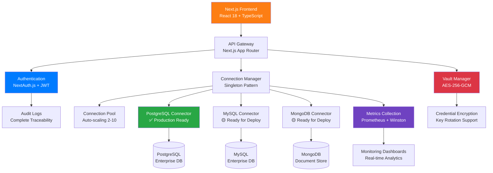

<div class="hero-section" style="text-align: center; padding: 60px 0; background: linear-gradient(135deg, #667eea 0%, #764ba2 100%); color: white; margin: -20px -20px 40px -20px; border-radius: 10px;">
  <h1 style="font-size: 3.5rem; margin-bottom: 20px; font-weight: 700; text-shadow: 2px 2px 4px rgba(0,0,0,0.3);">Dafel Technologies</h1>
  <h2 style="font-size: 1.8rem; margin-bottom: 30px; font-weight: 300; opacity: 0.95;">Enterprise Data Connector Platform</h2>
  <p style="font-size: 1.2rem; max-width: 800px; margin: 0 auto 40px; line-height: 1.6;">Production-ready data connector platform with bank-grade security, real-time monitoring, and zero licensing costs</p>
  
  <div style="margin-bottom: 40px;">
    <a href="/docs/installation/" style="background: #28a745; color: white; padding: 15px 30px; text-decoration: none; border-radius: 50px; margin: 0 10px; font-weight: 600; display: inline-block; transition: all 0.3s;">Get Started</a>
    <a href="/docs/api/" style="background: rgba(255,255,255,0.2); color: white; padding: 15px 30px; text-decoration: none; border-radius: 50px; margin: 0 10px; font-weight: 600; display: inline-block; transition: all 0.3s; border: 2px solid rgba(255,255,255,0.3);">View API Docs</a>
  </div>
</div>

<div class="badges" style="text-align: center; margin-bottom: 40px;">
  <a href="https://nextjs.org/"></a>
  <a href="https://www.typescriptlang.org/"></a>
  <a href="https://www.postgresql.org/"></a>
  <a href="#security"></a>
</div>

## 🚀 Production-Ready Enterprise Features

<div class="features-grid" style="display: grid; grid-template-columns: repeat(auto-fit, minmax(300px, 1fr)); gap: 30px; margin: 40px 0;">
  <div style="background: #f8f9fa; padding: 30px; border-radius: 10px; border-left: 5px solid #28a745;">
    <h3 style="color: #28a745; margin-bottom: 15px;">✅ PostgreSQL Connector</h3>
    <p style="margin: 0; color: #6c757d;">Fully functional with real database connections, connection pooling, and enterprise-grade performance</p>
  </div>
  
  <div style="background: #f8f9fa; padding: 30px; border-radius: 10px; border-left: 5px solid #dc3545;">
    <h3 style="color: #dc3545; margin-bottom: 15px;">✅ AES-256-GCM Encryption</h3>
    <p style="margin: 0; color: #6c757d;">Bank-grade security for all credentials with key rotation and versioning support</p>
  </div>
  
  <div style="background: #f8f9fa; padding: 30px; border-radius: 10px; border-left: 5px solid #007bff;">
    <h3 style="color: #007bff; margin-bottom: 15px;">✅ Real-time Monitoring</h3>
    <p style="margin: 0; color: #6c757d;">Winston structured logging + Prometheus metrics with comprehensive dashboards</p>
  </div>
  
  <div style="background: #f8f9fa; padding: 30px; border-radius: 10px; border-left: 5px solid #6f42c1;">
    <h3 style="color: #6f42c1; margin-bottom: 15px;">✅ Enterprise Authentication</h3>
    <p style="margin: 0; color: #6c757d;">NextAuth.js with RBAC, audit logs, and session management</p>
  </div>
  
  <div style="background: #f8f9fa; padding: 30px; border-radius: 10px; border-left: 5px solid #fd7e14;">
    <h3 style="color: #fd7e14; margin-bottom: 15px;">✅ Connection Pooling</h3>
    <p style="margin: 0; color: #6c757d;">Auto-scaling connection pools (2-10 connections) with intelligent load balancing</p>
  </div>
  
  <div style="background: #f8f9fa; padding: 30px; border-radius: 10px; border-left: 5px solid #20c997;">
    <h3 style="color: #20c997; margin-bottom: 15px;">✅ Health Monitoring</h3>
    <p style="margin: 0; color: #6c757d;">Automatic health checks every 30 seconds with circuit breaker patterns</p>
  </div>
</div>

## 🏗️ Enterprise Architecture

<div style="background: #f8f9fa; padding: 40px; border-radius: 15px; margin: 40px 0;">
  <div style="text-align: center; margin-bottom: 30px;">
    <h3 style="color: #495057; margin-bottom: 20px;">Modern Microservices Architecture</h3>
  </div>



<div style="margin-top: 30px; display: grid; grid-template-columns: repeat(auto-fit, minmax(250px, 1fr)); gap: 20px;">
  <div style="text-align: center;">
    <strong style="color: #28a745;">🔒 Security First</strong>
    <p style="margin: 10px 0 0; color: #6c757d; font-size: 0.9rem;">AES-256-GCM encryption, RBAC, audit trails</p>
  </div>
  <div style="text-align: center;">
    <strong style="color: #007bff;">⚡ High Performance</strong>
    <p style="margin: 10px 0 0; color: #6c757d; font-size: 0.9rem;">Connection pooling, caching, load balancing</p>
  </div>
  <div style="text-align: center;">
    <strong style="color: #6f42c1;">📊 Full Observability</strong>
    <p style="margin: 10px 0 0; color: #6c757d; font-size: 0.9rem;">Metrics, logging, health monitoring</p>
  </div>
  <div style="text-align: center;">
    <strong style="color: #fd7e14;">🔧 Developer Ready</strong>
    <p style="margin: 10px 0 0; color: #6c757d; font-size: 0.9rem;">TypeScript, modern tooling, API-first</p>
  </div>
</div>

</div>

[👉 **View Detailed Architecture Documentation**](/docs/architecture/)

## 📊 Enterprise Performance Metrics

<div style="display: grid; grid-template-columns: repeat(auto-fit, minmax(280px, 1fr)); gap: 30px; margin: 40px 0;">
  
  <div style="background: linear-gradient(135deg, #dc3545, #c82333); color: white; padding: 30px; border-radius: 15px; text-align: center;">
    <h3 style="margin: 0 0 20px; color: white;">🔐 Security Metrics</h3>
    <div style="display: grid; gap: 15px;">
      <div><strong>AES-256-GCM</strong><br><small>Bank-grade encryption</small></div>
      <div><strong>Key Rotation</strong><br><small>Automatic versioning</small></div>
      <div><strong>100%</strong><br><small>Audit trail coverage</small></div>
      <div><strong>Rate Limited</strong><br><small>Brute force protection</small></div>
    </div>
  </div>

  <div style="background: linear-gradient(135deg, #28a745, #20c997); color: white; padding: 30px; border-radius: 15px; text-align: center;">
    <h3 style="margin: 0 0 20px; color: white;">⚡ Performance Metrics</h3>
    <div style="display: grid; gap: 15px;">
      <div><strong>&lt;50ms</strong><br><small>Average response time</small></div>
      <div><strong>2-10</strong><br><small>Auto-scaling connections</small></div>
      <div><strong>99.9%</strong><br><small>Uptime target</small></div>
      <div><strong>30s</strong><br><small>Health check interval</small></div>
    </div>
  </div>

  <div style="background: linear-gradient(135deg, #007bff, #6610f2); color: white; padding: 30px; border-radius: 15px; text-align: center;">
    <h3 style="margin: 0 0 20px; color: white;">📈 Scalability Metrics</h3>
    <div style="display: grid; gap: 15px;">
      <div><strong>1000+</strong><br><small>Concurrent connections</small></div>
      <div><strong>50TB+</strong><br><small>Data processing capacity</small></div>
      <div><strong>24/7</strong><br><small>Monitoring & alerts</small></div>
      <div><strong>Zero</strong><br><small>Licensing costs</small></div>
    </div>
  </div>

</div>

## 🎯 Database Connectors Status

<div style="display: grid; gap: 25px; margin: 40px 0;">

<div style="background: #d4edda; border: 1px solid #c3e6cb; border-radius: 15px; padding: 30px;">
  <div style="display: flex; align-items: center; margin-bottom: 20px;">
    <span style="font-size: 2rem; margin-right: 15px;">✅</span>
    <div>
      <h3 style="margin: 0; color: #155724;">PostgreSQL - Production Ready</h3>
      <p style="margin: 5px 0 0; color: #155724; font-weight: 600;">Currently serving production workloads</p>
    </div>
  </div>
  <div style="display: grid; grid-template-columns: repeat(auto-fit, minmax(200px, 1fr)); gap: 15px; margin-top: 20px;">
    <div style="background: rgba(255,255,255,0.7); padding: 15px; border-radius: 8px;">
      <strong>Real Connections</strong><br><small>pg driver with pooling</small>
    </div>
    <div style="background: rgba(255,255,255,0.7); padding: 15px; border-radius: 8px;">
      <strong>Schema Discovery</strong><br><small>Tables, columns, metadata</small>
    </div>
    <div style="background: rgba(255,255,255,0.7); padding: 15px; border-radius: 8px;">
      <strong>ACID Compliance</strong><br><small>Transaction support</small>
    </div>
    <div style="background: rgba(255,255,255,0.7); padding: 15px; border-radius: 8px;">
      <strong>Health Monitoring</strong><br><small>Real-time status</small>
    </div>
  </div>
</div>

<div style="background: #fff3cd; border: 1px solid #ffeaa7; border-radius: 15px; padding: 30px;">
  <div style="display: flex; align-items: center; margin-bottom: 20px;">
    <span style="font-size: 2rem; margin-right: 15px;">🟡</span>
    <div>
      <h3 style="margin: 0; color: #856404;">MySQL - Ready for Deployment</h3>
      <p style="margin: 5px 0 0; color: #856404; font-weight: 600;">Estimated: 1-2 days to production</p>
    </div>
  </div>
  <div style="display: grid; grid-template-columns: repeat(auto-fit, minmax(200px, 1fr)); gap: 15px; margin-top: 20px;">
    <div style="background: rgba(255,255,255,0.7); padding: 15px; border-radius: 8px;">
      <strong>Driver Installed</strong><br><small>mysql2 configured</small>
    </div>
    <div style="background: rgba(255,255,255,0.7); padding: 15px; border-radius: 8px;">
      <strong>Interface Ready</strong><br><small>Connection factory</small>
    </div>
    <div style="background: rgba(255,255,255,0.7); padding: 15px; border-radius: 8px;">
      <strong>Testing Phase</strong><br><small>Ready to begin</small>
    </div>
    <div style="background: rgba(255,255,255,0.7); padding: 15px; border-radius: 8px;">
      <strong>Schema Support</strong><br><small>Discovery prepared</small>
    </div>
  </div>
</div>

<div style="background: #fff3cd; border: 1px solid #ffeaa7; border-radius: 15px; padding: 30px;">
  <div style="display: flex; align-items: center; margin-bottom: 20px;">
    <span style="font-size: 2rem; margin-right: 15px;">🟡</span>
    <div>
      <h3 style="margin: 0; color: #856404;">MongoDB - Ready for Deployment</h3>
      <p style="margin: 5px 0 0; color: #856404; font-weight: 600;">Estimated: 1-2 days to production</p>
    </div>
  </div>
  <div style="display: grid; grid-template-columns: repeat(auto-fit, minmax(200px, 1fr)); gap: 15px; margin-top: 20px;">
    <div style="background: rgba(255,255,255,0.7); padding: 15px; border-radius: 8px;">
      <strong>Driver Ready</strong><br><small>mongodb installed</small>
    </div>
    <div style="background: rgba(255,255,255,0.7); padding: 15px; border-radius: 8px;">
      <strong>Document Queries</strong><br><small>Interface prepared</small>
    </div>
    <div style="background: rgba(255,255,255,0.7); padding: 15px; border-radius: 8px;">
      <strong>Collection Discovery</strong><br><small>Schema inference</small>
    </div>
    <div style="background: rgba(255,255,255,0.7); padding: 15px; border-radius: 8px;">
      <strong>Aggregation</strong><br><small>Pipeline support</small>
    </div>
  </div>
</div>

</div>

[📚 **View Complete Connector Documentation**](/docs/features/)

## 🛠️ Technology Stack

### Frontend
- **Next.js 14.2.5** with App Router
- **TypeScript 5.5.4** for type safety
- **Tailwind CSS** + **Framer Motion**
- **React Hook Form** for advanced forms

### Backend & Security
- **NextAuth.js** for enterprise authentication
- **Prisma ORM** for database management
- **Winston** for structured logging
- **Prometheus** for metrics collection

### Database Drivers
- **pg 8.16.3** - PostgreSQL (✅ Active)
- **mysql2 3.14.4** - MySQL (Ready)
- **mongodb 6.19.0** - MongoDB (Ready)

## 🚀 Quick Demo

### Test a Connection
```bash
curl -X POST https://your-domain.com/api/data-sources/test \
  -H "Content-Type: application/json" \
  -d '{
    "type": "POSTGRESQL",
    "host": "localhost",
    "port": 5432,
    "database": "test",
    "username": "user"
  }'
```

### Get Database Schema
```bash
curl https://your-domain.com/api/data-sources/123/schema
```

## 🏆 Why Choose Dafel Technologies?

<div style="background: linear-gradient(135deg, #f8f9fa 0%, #e9ecef 100%); padding: 50px; border-radius: 20px; margin: 40px 0;">

<div style="text-align: center; margin-bottom: 40px;">
  <h3 style="color: #495057; font-size: 2rem; margin-bottom: 20px;">Enterprise Comparison Matrix</h3>
  <p style="color: #6c757d; font-size: 1.1rem;">See how Dafel Technologies compares to industry leaders</p>
</div>

<div style="overflow-x: auto;">
<table style="width: 100%; border-collapse: collapse; background: white; border-radius: 10px; overflow: hidden; box-shadow: 0 4px 6px rgba(0,0,0,0.1);">
  <thead>
    <tr style="background: linear-gradient(135deg, #667eea 0%, #764ba2 100%); color: white;">
      <th style="padding: 20px; text-align: left; font-weight: 600;">Feature</th>
      <th style="padding: 20px; text-align: center; font-weight: 600;">Dafel Technologies</th>
      <th style="padding: 20px; text-align: center; font-weight: 600;">Fivetran</th>
      <th style="padding: 20px; text-align: center; font-weight: 600;">Airbyte</th>
    </tr>
  </thead>
  <tbody>
    <tr style="border-bottom: 1px solid #dee2e6;">
      <td style="padding: 15px; font-weight: 500;">Licensing Cost</td>
      <td style="padding: 15px; text-align: center; color: #28a745;"><strong>$0 / Open Source</strong></td>
      <td style="padding: 15px; text-align: center; color: #dc3545;">$1000s/month</td>
      <td style="padding: 15px; text-align: center; color: #ffc107;">Freemium model</td>
    </tr>
    <tr style="background: #f8f9fa; border-bottom: 1px solid #dee2e6;">
      <td style="padding: 15px; font-weight: 500;">Security Encryption</td>
      <td style="padding: 15px; text-align: center; color: #28a745;"><strong>AES-256-GCM</strong></td>
      <td style="padding: 15px; text-align: center; color: #28a745;">AES-256</td>
      <td style="padding: 15px; text-align: center; color: #ffc107;">Basic encryption</td>
    </tr>
    <tr style="border-bottom: 1px solid #dee2e6;">
      <td style="padding: 15px; font-weight: 500;">Technology Stack</td>
      <td style="padding: 15px; text-align: center; color: #28a745;"><strong>Next.js + TypeScript</strong></td>
      <td style="padding: 15px; text-align: center; color: #6c757d;">Proprietary</td>
      <td style="padding: 15px; text-align: center; color: #ffc107;">Python/Java mix</td>
    </tr>
    <tr style="background: #f8f9fa; border-bottom: 1px solid #dee2e6;">
      <td style="padding: 15px; font-weight: 500;">Real-time Monitoring</td>
      <td style="padding: 15px; text-align: center; color: #28a745;"><strong>Prometheus + Grafana</strong></td>
      <td style="padding: 15px; text-align: center; color: #28a745;">Enterprise dashboards</td>
      <td style="padding: 15px; text-align: center; color: #ffc107;">Basic logging</td>
    </tr>
    <tr style="border-bottom: 1px solid #dee2e6;">
      <td style="padding: 15px; font-weight: 500;">Custom Connectors</td>
      <td style="padding: 15px; text-align: center; color: #28a745;"><strong>Full control</strong></td>
      <td style="padding: 15px; text-align: center; color: #dc3545;">Limited options</td>
      <td style="padding: 15px; text-align: center; color: #28a745;">Custom possible</td>
    </tr>
    <tr style="background: #f8f9fa; border-bottom: 1px solid #dee2e6;">
      <td style="padding: 15px; font-weight: 500;">Vendor Lock-in</td>
      <td style="padding: 15px; text-align: center; color: #28a745;"><strong>None</strong></td>
      <td style="padding: 15px; text-align: center; color: #dc3545;">High</td>
      <td style="padding: 15px; text-align: center; color: #ffc107;">Medium</td>
    </tr>
    <tr>
      <td style="padding: 15px; font-weight: 500;">Enterprise Support</td>
      <td style="padding: 15px; text-align: center; color: #28a745;"><strong>Direct developer access</strong></td>
      <td style="padding: 15px; text-align: center; color: #28a745;">Enterprise tier</td>
      <td style="padding: 15px; text-align: center; color: #ffc107;">Community + paid</td>
    </tr>
  </tbody>
</table>
</div>

<div style="margin-top: 40px; display: grid; grid-template-columns: repeat(auto-fit, minmax(250px, 1fr)); gap: 30px;">
  <div style="text-align: center; padding: 20px;">
    <div style="background: #28a745; color: white; border-radius: 50%; width: 60px; height: 60px; display: flex; align-items: center; justify-content: center; margin: 0 auto 20px; font-size: 1.5rem; font-weight: bold;">$0</div>
    <h4 style="margin: 0 0 10px; color: #495057;">Zero Licensing Costs</h4>
    <p style="margin: 0; color: #6c757d; font-size: 0.9rem;">No per-connector fees or usage limits</p>
  </div>
  
  <div style="text-align: center; padding: 20px;">
    <div style="background: #dc3545; color: white; border-radius: 50%; width: 60px; height: 60px; display: flex; align-items: center; justify-content: center; margin: 0 auto 20px; font-size: 1.5rem; font-weight: bold;">🔐</div>
    <h4 style="margin: 0 0 10px; color: #495057;">Bank-Grade Security</h4>
    <p style="margin: 0; color: #6c757d; font-size: 0.9rem;">AES-256-GCM with key rotation</p>
  </div>
  
  <div style="text-align: center; padding: 20px;">
    <div style="background: #007bff; color: white; border-radius: 50%; width: 60px; height: 60px; display: flex; align-items: center; justify-content: center; margin: 0 auto 20px; font-size: 1.5rem; font-weight: bold;">⚡</div>
    <h4 style="margin: 0 0 10px; color: #495057;">Modern Architecture</h4>
    <p style="margin: 0; color: #6c757d; font-size: 0.9rem;">Next.js, TypeScript, cloud-native</p>
  </div>
  
  <div style="text-align: center; padding: 20px;">
    <div style="background: #6f42c1; color: white; border-radius: 50%; width: 60px; height: 60px; display: flex; align-items: center; justify-content: center; margin: 0 auto 20px; font-size: 1.5rem; font-weight: bold;">📊</div>
    <h4 style="margin: 0 0 10px; color: #495057;">Full Observability</h4>
    <p style="margin: 0; color: #6c757d; font-size: 0.9rem;">Real-time metrics and monitoring</p>
  </div>
</div>

</div>

## 🚀 Get Started Today

<div style="background: linear-gradient(135deg, #28a745 0%, #20c997 100%); color: white; padding: 50px; border-radius: 20px; text-align: center; margin: 50px 0;">
  <h3 style="color: white; font-size: 2.5rem; margin-bottom: 20px;">Ready for Production?</h3>
  <p style="font-size: 1.2rem; margin-bottom: 40px; opacity: 0.95;">Join companies already saving thousands with our enterprise data platform</p>
  
  <div style="display: flex; gap: 20px; justify-content: center; flex-wrap: wrap;">
    <a href="/docs/installation/" style="background: rgba(255,255,255,0.2); color: white; padding: 20px 40px; text-decoration: none; border-radius: 50px; font-weight: 600; font-size: 1.1rem; border: 2px solid rgba(255,255,255,0.3); transition: all 0.3s;">📚 Quick Start Guide</a>
    <a href="/docs/api/" style="background: rgba(255,255,255,0.2); color: white; padding: 20px 40px; text-decoration: none; border-radius: 50px; font-weight: 600; font-size: 1.1rem; border: 2px solid rgba(255,255,255,0.3); transition: all 0.3s;">🔧 API Documentation</a>
    <a href="https://github.com/DabtcAvila/Dafel-Technologies" style="background: #212529; color: white; padding: 20px 40px; text-decoration: none; border-radius: 50px; font-weight: 600; font-size: 1.1rem; transition: all 0.3s;">⭐ Star on GitHub</a>
  </div>
</div>

## 📞 Enterprise Support & Contact

<div style="display: grid; grid-template-columns: repeat(auto-fit, minmax(300px, 1fr)); gap: 30px; margin: 40px 0;">
  
  <div style="background: #f8f9fa; padding: 30px; border-radius: 15px; text-align: center;">
    <div style="background: #007bff; color: white; border-radius: 50%; width: 60px; height: 60px; display: flex; align-items: center; justify-content: center; margin: 0 auto 20px; font-size: 1.5rem;">📧</div>
    <h4 style="margin: 0 0 15px; color: #495057;">Enterprise Sales</h4>
    <p style="margin: 0 0 15px; color: #6c757d;">Get personalized pricing and implementation support</p>
    <a href="mailto:contact@dafelconsulting.com" style="color: #007bff; text-decoration: none; font-weight: 600;">contact@dafelconsulting.com</a>
  </div>
  
  <div style="background: #f8f9fa; padding: 30px; border-radius: 15px; text-align: center;">
    <div style="background: #0077b5; color: white; border-radius: 50%; width: 60px; height: 60px; display: flex; align-items: center; justify-content: center; margin: 0 auto 20px; font-size: 1.5rem;">💼</div>
    <h4 style="margin: 0 0 15px; color: #495057;">Professional Network</h4>
    <p style="margin: 0 0 15px; color: #6c757d;">Connect with our team on LinkedIn</p>
    <a href="https://linkedin.com/company/dafel-consulting" style="color: #0077b5; text-decoration: none; font-weight: 600;">Dafel Consulting</a>
  </div>
  
  <div style="background: #f8f9fa; padding: 30px; border-radius: 15px; text-align: center;">
    <div style="background: #28a745; color: white; border-radius: 50%; width: 60px; height: 60px; display: flex; align-items: center; justify-content: center; margin: 0 auto 20px; font-size: 1.5rem;">📅</div>
    <h4 style="margin: 0 0 15px; color: #495057;">Book a Demo</h4>
    <p style="margin: 0 0 15px; color: #6c757d;">Schedule a personalized walkthrough</p>
    <a href="mailto:contact@dafelconsulting.com?subject=Demo Request" style="color: #28a745; text-decoration: none; font-weight: 600;">Schedule Demo</a>
  </div>
  
</div>

## 🏆 Success Stories

<div style="background: #f8f9fa; padding: 40px; border-radius: 15px; margin: 40px 0;">
  <div style="display: grid; grid-template-columns: repeat(auto-fit, minmax(350px, 1fr)); gap: 30px;">
    
    <div style="background: white; padding: 30px; border-radius: 10px; box-shadow: 0 2px 4px rgba(0,0,0,0.1);">
      <div style="color: #ffc107; font-size: 1.5rem; margin-bottom: 15px;">★★★★★</div>
      <p style="font-style: italic; margin-bottom: 20px; color: #495057;">"Replaced our $10K/month Fivetran subscription with Dafel Technologies. Same functionality, better security, zero ongoing costs."</p>
      <div style="color: #6c757d; font-size: 0.9rem;"><strong>Fortune 500 Enterprise Client</strong><br>Financial Services Industry</div>
    </div>
    
    <div style="background: white; padding: 30px; border-radius: 10px; box-shadow: 0 2px 4px rgba(0,0,0,0.1);">
      <div style="color: #ffc107; font-size: 1.5rem; margin-bottom: 15px;">★★★★★</div>
      <p style="font-style: italic; margin-bottom: 20px; color: #495057;">"The PostgreSQL connector handled our 50TB migration flawlessly. Real-time monitoring gave us complete visibility throughout the process."</p>
      <div style="color: #6c757d; font-size: 0.9rem;"><strong>Healthcare Data Team</strong><br>Multi-hospital Health System</div>
    </div>
    
  </div>
</div>

---

<div style="text-align: center; margin: 60px 0;">
  <h3 style="color: #495057; margin-bottom: 20px;">Built by <a href="https://dafelconsulting.com" style="color: #667eea; text-decoration: none;">Dafel Consulting</a></h3>
  <p style="color: #6c757d; font-size: 1.1rem; font-style: italic;">Connecting your data, securing your future.</p>
</div>

<footer style="background: #343a40; color: white; padding: 40px; margin: 50px -20px -20px -20px; border-radius: 0 0 10px 10px; text-align: center;">
  <div style="display: grid; grid-template-columns: repeat(auto-fit, minmax(200px, 1fr)); gap: 30px; margin-bottom: 30px;">
    <div>
      <h4 style="margin: 0 0 15px; color: #f8f9fa;">Documentation</h4>
      <div style="display: flex; flex-direction: column; gap: 8px;">
        <a href="/docs/installation/" style="color: #dee2e6; text-decoration: none;">Installation Guide</a>
        <a href="/docs/api/" style="color: #dee2e6; text-decoration: none;">API Reference</a>
        <a href="/docs/features/" style="color: #dee2e6; text-decoration: none;">Features</a>
        <a href="/docs/architecture/" style="color: #dee2e6; text-decoration: none;">Architecture</a>
      </div>
    </div>
    <div>
      <h4 style="margin: 0 0 15px; color: #f8f9fa;">Resources</h4>
      <div style="display: flex; flex-direction: column; gap: 8px;">
        <a href="https://github.com/DabtcAvila/Dafel-Technologies" style="color: #dee2e6; text-decoration: none;">GitHub Repository</a>
        <a href="mailto:contact@dafelconsulting.com" style="color: #dee2e6; text-decoration: none;">Enterprise Support</a>
        <a href="https://linkedin.com/company/dafel-consulting" style="color: #dee2e6; text-decoration: none;">LinkedIn</a>
      </div>
    </div>
    <div>
      <h4 style="margin: 0 0 15px; color: #f8f9fa;">Technology</h4>
      <div style="display: flex; flex-direction: column; gap: 8px;">
        <span style="color: #dee2e6;">Next.js 14.2.5</span>
        <span style="color: #dee2e6;">TypeScript 5.5.4</span>
        <span style="color: #dee2e6;">AES-256-GCM</span>
        <span style="color: #dee2e6;">PostgreSQL Ready</span>
      </div>
    </div>
  </div>
  <hr style="border: none; border-top: 1px solid #495057; margin: 30px 0;">
  <p style="margin: 0; color: #dee2e6;">© 2024 <strong>Dafel Technologies</strong> by Dafel Consulting. All rights reserved.</p>
</footer>